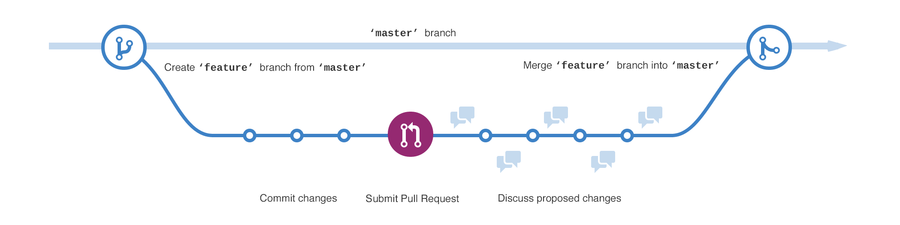

# Table des matières
- [Github workflow](#github-workflow)  
- [Semantic Versioning](#semantic-versioning)
- [Maven](#maven)  
- [Travis CI](#travis-ci)
- [Junit](#junit)
- [JaCoCo](#jacoco)
- [Javadoc](#javadoc)
- [Docker & Docker Hub](#docker-et-docker-hub)
- [Outils annexes](#autres-outils)
  - [CodeCov](#codecov)
  - [Code Climate](#code-climate)


# Github workflow
- [Branches](#branches)
- [Utilisation](#utilisation)
  - [Création d'une branche](#creation-d-une-branche)
  - [Ouverture d'une pull request](#ouverture-d-une-pull-request)
  - [Suppression de la branche](#suppression-de-la-branche)
- [Imposer des restrictions de merge](#imposer-des-restrictions-de-merge)

### Branches
- **master** : branche principale, contient la dernière release
- **\<feature-name>** : branche de feature ou de bugfix basée sur *master*

### Utilisation



Chaque nouvelle fonctionnalité ou correction est développé sur une nouvelle branche basée sur *master*. Lorsque la fonctionnalité/correction est terminée, une pull request est ouverte pour pouvoir en discuter avec les collaborateurs. La branche n'est fusionnée avec *master* qu'une fois vérifiée et acceptée.

##### Création d'une branche <a name="creation-d-une-branche"></a>
Lorsqu'un ou plusieurs développeurs commencent à travailler sur une nouvelle fonctionnalité ou sur une correction de bug, une nouvelle branche basée sur master est créée.  
Pour ça, il faut avant tout se placer sur la branche master :   
```
git checkout master
```
puis créer une nouvelle branche, se placer dessus et la publier :  
```
git branch <feature-name>
git checkout <feature-name>
git push -u origin <feature-name>
```
> Publier la branche peut se faire à n'importe quel moment avant la pull request

##### Ouverture d'une pull-request <a name="creation-d-une-pull-request"></a>
Lorsqu'une fonctionnalité ou correction est terminée, il faut ouvrir une pull request afin de pouvoir la fusionner sur *master*. Pour cela, il suffit d'aller sur son dépôt [Github](github.com), de se mettre sur la branche de la feature et de cliquer sur **New pull request**.  


L'attribut **base** de la pull request représente la branche sur laquelle on souhaite fusionner la feature.


Une fois la pull request ouverte, les collaborateurs peuvent la passer en revue et y ajouter des commentaires.  
Les éventuelles corrections et modifications peuvent être push sur la branche *\<feature-name>* et les nouveaux commit apparaîtront sur la pull request.  
Avant de fermer la pull request, la branche *\<feature-name>* doit être à jour sur *master*. Pour cela, il faut d'abord récupérer les changements sur master :
```
git checkout master
git pull
```
puis refusionner *master* sur la branche *\<feature-name>* :
```
git checkout <feature-name>
git merge master
```
> Il est possible de mettre à jour la branche directement depuis la pull request de Github puis de faire un simple `git pull` sur la branche locale

Lorsque la branche est prête à être mise en production, la pull request est fermée et la branche *\<feature-name>* est fusionnée sur *master*.

##### Suppression de la branche
Pour supprimer une branche, il faut lancer les commandes :
```
git branch -d <branch-name>
git push origin --delete <branch-name>
```

### Imposer des restrictions de merge
Il est possible d'imposer des restrictions de merge sur *master*, notamment obliger l'ouverture de pull request depuis une branche non protégée pour pouvoir commit sur *master*, et demander à ce que la branche de la pull request soit à jour sur *master* et qu'elle passe le build de Travis CI.
Pour cela, il faut ajouter une règle sur *master* dans **Settings/Branches** du dépôt Github avec les options suivantes :
```
- Require pull request reviews before merging (OPTIONNEL)
- Require status checks to pass before merging
  - Require branches to be up to date before merging
  - Travis CI - Branch
- Include administrators
```


# Semantic Versioning
Les numéros de version suivent le principe de Semantic Versioning 2.0.0 (https://semver.org/).
Un numéro de version s'écrit MAJOR.MINOR.PATCH (ex: 1.3.16).
- **MAJOR** : incrémenté lorsque de gros changements ont été effectués (souvent lorsqu'il n'y a pas de rétrocompatibilité avec la version précédente)
- **MINOR** : incrémenté lorsque de nouvelles fonctionnalités ont été ajoutées avec rétrocompatibilité, ou que des corrections majeures ont été apportées
- **PATCH** : incrémenté lorsqu'une ou plusieurs corrections ont été apportées

La première version stable et complète du logiciel est numérotée 1.0.0. Les versions 0.x.y sont réservés aux premières versions de développement.
La release d'un version X.Y.Z est taggée avec le préfixe *v* suivi du numéro de version, c'est-à-dire vX.Y.Z.


# Maven
- [Création d'un projet](#creation-d-un-projet)
- [Numéro de version](#numero-de-version)
- [Phases et cycle de vie](#phases-et-cycle-de-vie)

Maven est un outil utilisé pour gérer et automatiser la production de projets logiciels. Il permet notamment de créer un projet selon une structure de base, et d'automatiser la compilation et l'installation du logiciel.

### Création d'un projet <a name="creation-d-un-projet"></a>
Pour générer un projet suivant la structure standard de Maven, il faut lancer la commande :
```
mvn archetype:generate -DgroupId=domain.mygroup -DartifactId=my-app -DarchetypeArtifactId=maven-archetype-quickstart
```  
- **groupId** : identifiant du groupe développant le logiciel. Il s'agit souvent du nom de domaine inversé (ex: org.blender).
- **artifactId** : nom du projet.

La structure du projet est alors :  
```
my-app/
├── pom.xml
└── src
    ├── main
    │   └── java
    │       └── domain
    │           └── mygroup
    │               └── App.java
    └── test
        └── java
            └── domain
                └── mygroup
                    └── AppTest.java

```
Le fichier pom.xml est le fichier de configuration de Maven pour le projet.

### Numéro de version
Le numéro de version actuel est indiqué dans le fichier pom.xml.  
Il est suffixé de "-SNAPSHOT" lorsqu'il s'agit d'une version en développement. Le code source peut alors être modifié tout en restant sur la même version.  
Lors d'une release, le suffixe "-SNAPSHOT" est retiré et la version est définitive. Tout changement dans le code d'une version de release implique un changement de numéro de version (on incrémente généralement le PATCH).

### Phases et cycle de vie
Maven fonctionne avec un cycle de vie de production décomposé en plusieurs phases. Le cycle par défaut est composé des phases suivantes :
- **validate** : valide si le projet et correct et que toutes les informations nécessaires sont présentes
- **compile** : compile le code source
- **test** : lance les tests unitaires
- **package** : crée le package à partir de code source compilé (en .jar par exemple)
- **verify** : éxamine les résultats des tests d'intégration
- **install** : installe le package dans le dossier local (par défaut, dans $HOME/.m2/repository/my-group/my-app/version/)
- **deploy** : déploie le package final sur le dépôt de package distant

Ces phases sont exécutées séquentiellement. Lancer la commande `mvn package` va donc dans l'ordre exécuter les phases *validate*, *compile*, *test* puis *package*.


# Travis CI
- [Mise en place](#mise-en-place)
- [Cycle de vie](#cycle-de-vie)
- [Travis CI et Maven](#travis-ci-et-maven)

Travis CI est un service en ligne d'intégration continue pour les projets hébergés sur Github. Il permet de définir des tâches à effectuer lorsqu'un commit est envoyé sur le dépôt github.  

### Mise en place
Pour mettre en place Travis CI sur un projet existant, il faut d'abord s'identifier sur [travis-ci.com](https://travis-ci.com) avec son compte github et ajouter le dépôt du projet aux autorisations de Travis CI.  
Ensuite, il faut créer un fichier *.travis.yml* à ajouter à la racine du projet, puis y indiquer le langage de programmation et éventuellement la ou les versions de ce langage :
```yml
language: java
jdk:
  - openjdk8
```

### Cycle de vie
De manière analogue à Maven, Travis CI fonctionne avec son propre cycle de vie. Les phases principales sont :
- **install** : installe les dépendances du projet
- **script** : exécute le script de build
- **deploy** (OPTIONNEL) : déploie le logiciel

Il existe également des phases intermédiaires. Les phases sont exécutées séquentiellement et le cycle de vie complet est le suivant :
1. `before_install`
2. `install`
3. `before_script`
4. `script`
5. `after_success` ou `after_failure`
6. `before_deploy` (OPTIONNEL)
7. `deploy` (OPTIONNEL)
8. `after_deploy` (OPTIONNEL)
9. `after_script`

> Certaines phases optionnelles ont été omises ici pour plus de clarté. Le cycle de vie complet est indiqué sur la [documentation](https://docs.travis-ci.com/user/job-lifecycle/#the-job-lifecycle) de Travis CI.

A chaque push sur le dépôt distant, Travis CI lance un nouvel environnement, commence par installer les dépendances, puis exécute le *script* et surveille l'état du build (*passed* ou *failed*).  

### Travis CI et Maven
Travis CI est configuré pour utiliser automatiquement Maven lorsque le fichier pom.xml est présent à la racine du projet.  
Lors d'un build, les dépendances indiquées dans *pom.xml* sont installées dans le nouvel environnement et le script par défaut `mvn test -B` (compile le code source et lance les tests unitaires) est exécuté.  
Il est possible d'accélérer le build en utilisant le cache de Travis CI pour éviter de réinstaller les dépendances à chaque fois. Il suffit pour cela d'ajouter dans le fichier *.travis.yml* :
```yml
cache:
  directories:
    - $HOME/.m2
```


# Junit


# JaCoCo


# Javadoc


# Docker & Docker Hub <a name="docker-et-docker-hub"></a>


# Autres outils
- [CodeCov](#codecov)
- [Code Climate](#code-climate)

### CodeCov
CodeCov est un service en ligne permettant d'analyser les rapports de couverture de code (générés par des outils comme JaCoCo) d'un projet logiciel.  
Il s'intègre facilement avec l'utilisation de Travis CI. Il faut simplement ajouter au fichier *.travis.yml* :
```yml
after_success:
  - bash <(curl -s https://codecov.io/bash)
```
La commande bash permet d'envoyer le rapport de couverture à CodeCov. *after_success* signifie que le rapport n'est envoyé que si le build passe.


### Code Climate
Code Climate est un service en ligne permettant entre autres d'analyser la qualité du code d'un projet.  
Pour l'utiliser, il faut se rendre sur [codeclimate.com](#https://codeclimate.com) et se connecter avec son compte Github (dans login/Quality). On peut alors ajouter des dépôts publiques sur Code Climate.
